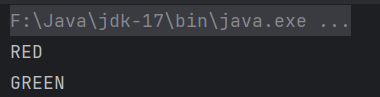
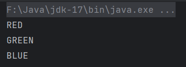

## 案例一

```java
public class Demo {
    public static void main(String[] args) {
        Color red = Color.RED;
        System.out.println(red);

        Color green = Color.GREEN;
        System.out.println(green);

        Color blue = Color.BLUE;
        System.out.println(blue);
    }
}

enum Color {
    RED,
    GREEN,
    BLUE;
}
```

 

## 案例二

> 内部类中使用枚举

```java
public class Demo01 {
    enum Color {
        RED, GREEN;
    }

    public static void main(String[] args) {
        Color red = Color.RED;
        System.out.println(red);

        Color green = Color.GREEN;
        System.out.println(green);
    }
}
```

 

## 迭代枚举元素

> for语句迭代枚举元素

```java
enum Color {
    RED,
    GREEN,
    BLUE;
}
```

```java
public class Demo02 {
    public static void main(String[] args) {
        for (Color value : Color.values()) {
            System.out.println(value);
        }
    }
}
```

 

## 其他用法和高级用法（TODO）

[Java 枚举(enum) | 菜鸟教程 (runoob.com)](https://www.runoob.com/java/java-enum.html)

## 总结

所有枚举值都是public static final

```java
class Color
{
     public static final Color RED = new Color();
     public static final Color BLUE = new Color();
     public static final Color GREEN = new Color();
}
```

