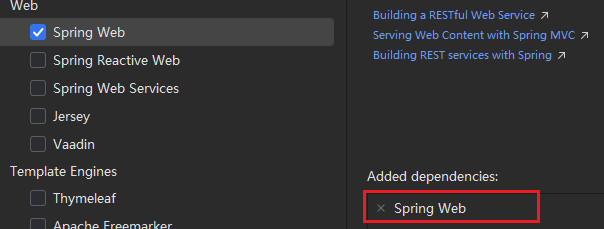

## 需求

 

## SpringBoot手动创建步骤

 

### 创建Maven项目并且关联Github

 

### 导入起步依赖

```xml
<!--springboot需要继承的父工程-->
<parent>
    <groupId>org.springframework.boot</groupId>
    <artifactId>spring-boot-starter-parent</artifactId>
    <version>2.7.12</version>
</parent>

<dependencies>
    <!--web开发的起步依赖-->
    <dependency>
        <groupId>org.springframework.boot</groupId>
        <artifactId>spring-boot-starter-web</artifactId>
    </dependency>
</dependencies>
```

### 定义Controller

```java
package com.example.controller;

import org.springframework.web.bind.annotation.GetMapping;
import org.springframework.web.bind.annotation.RestController;

@RestController
public class HelloController {
    @GetMapping("/hello")
    public String hello() {
        return "hello";
    }
}
```

### 编写启动类

```java
package com.example;

import org.springframework.boot.SpringApplication;
import org.springframework.boot.autoconfigure.SpringBootApplication;

@SpringBootApplication
public class HelloApplication {
    public static void main(String[] args) {
        SpringApplication.run(HelloApplication.class, args);
    }
}
```

### 启动测试

 

## SpringBoot自动创建步骤

### 使用Spring Initializer创建Maven项目

更换为阿里云的初始化器  

 

 

 

### 直接运行，依赖、引导类和Controller都已经写好

 

 


### 


