## 简介

> Spring Cache 基于注解的缓存功能

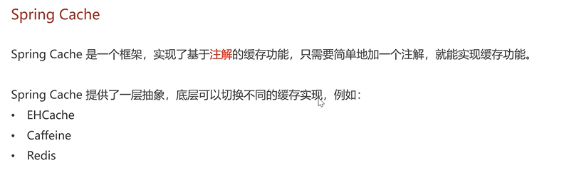

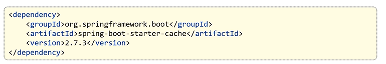

## 常用注解

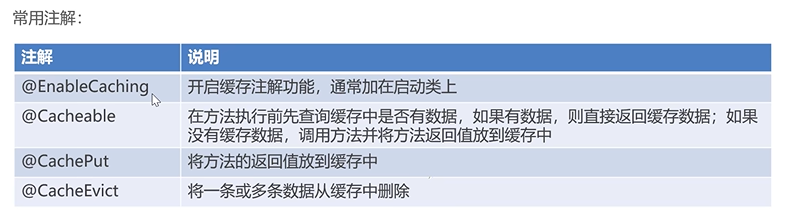

## 入门案例

### 启动类加注解

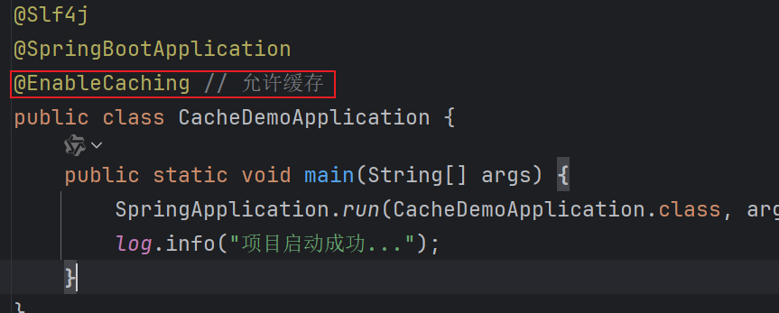

### controller加注解

使用CachePut注解

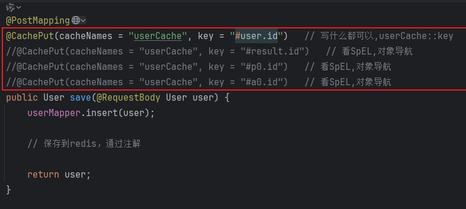

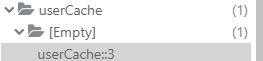

使用Cacheable注解

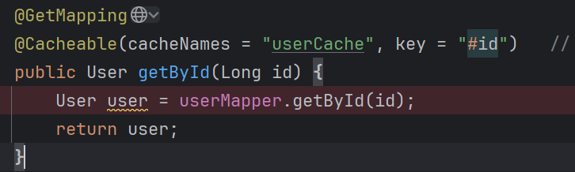

> 先通过代理

使用CacheEvict注解

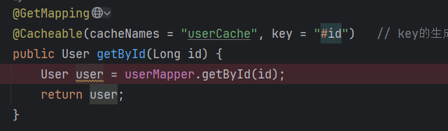

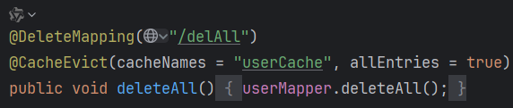

## 苍穹外卖案例

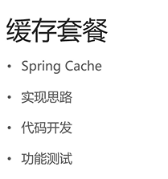

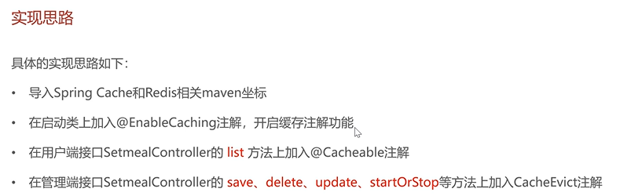

坐标

```xml
<dependency>
    <groupId>org.springframework.boot</groupId>
    <artifactId>spring-boot-starter-data-redis</artifactId>
</dependency>

<dependency>
    <groupId>org.springframework.boot</groupId>
    <artifactId>spring-boot-starter-cache</artifactId>
</dependency>
```

启动类注解

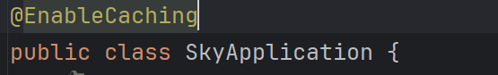

controller注解

user的controller

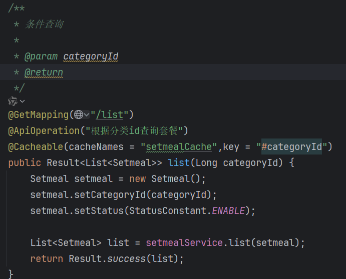

admin的controller

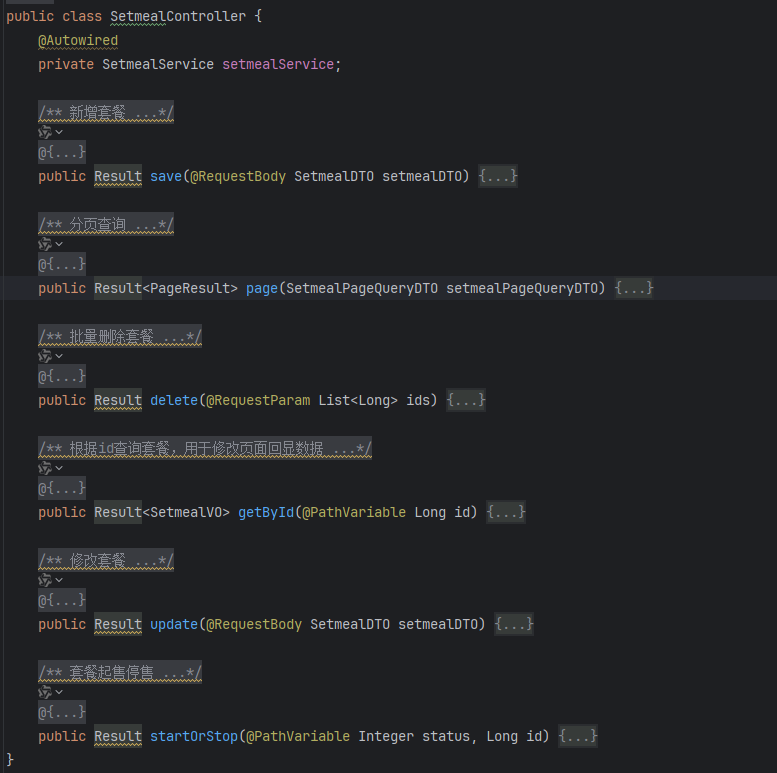

> 注解的key的注释
>
> SpEL

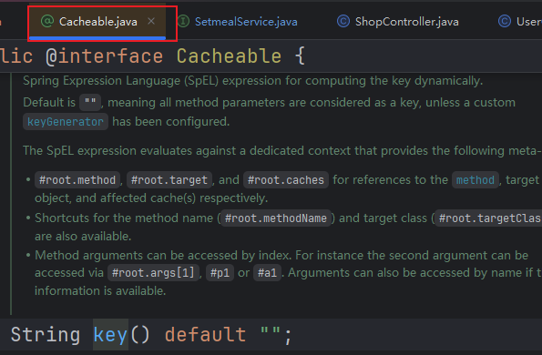

