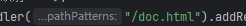
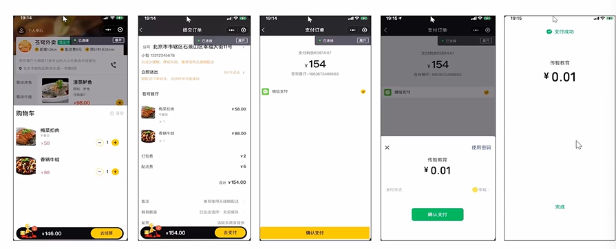

## 接口文档

## apifox

## postman

## SpringBoot使用Redis

## Redis配置密码(windows和linux)

## Spring Cache

## 对象的属性拷贝

## 自定义注解进行切面编程

## threadLocal

## LocalDateTime

## 构建器和普通对象创建的区别

## 这样的图来指导开发

## 灵活调整配送费和餐具费

## 仔细研究数据库表的设计

## 数据库的表设计要加s吗，对于复数

## 接口设计

## @Api(tags = "用户端订单相关接口")

## @Component

## utm8mb4

## 属性拷贝完成之后，设置值的工作需要加速

## 插入数据设置返回值的验证

## 注解

## 配置文件

## 微信支付（暂时跳过,代码已经粘贴完毕，没有测试）

[【苍穹外卖】个人小程序模拟实现微信支付_微信支付模拟开发-CSDN博客](https://blog.csdn.net/m0_45892187/article/details/132677932)

## JWT认证的细节，后端服务器重启，前端的登录好有效吗（过期时间设置了吗）

## 

