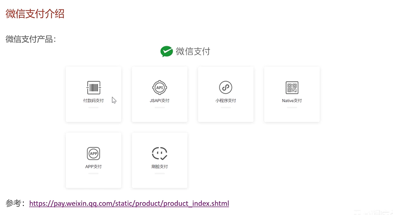
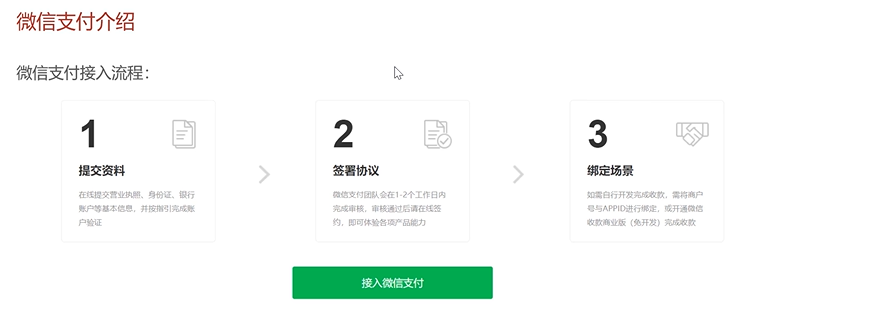
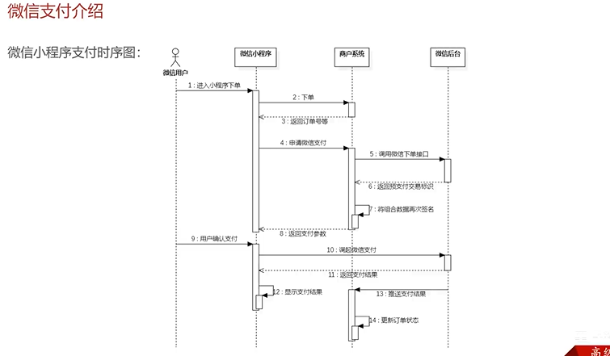
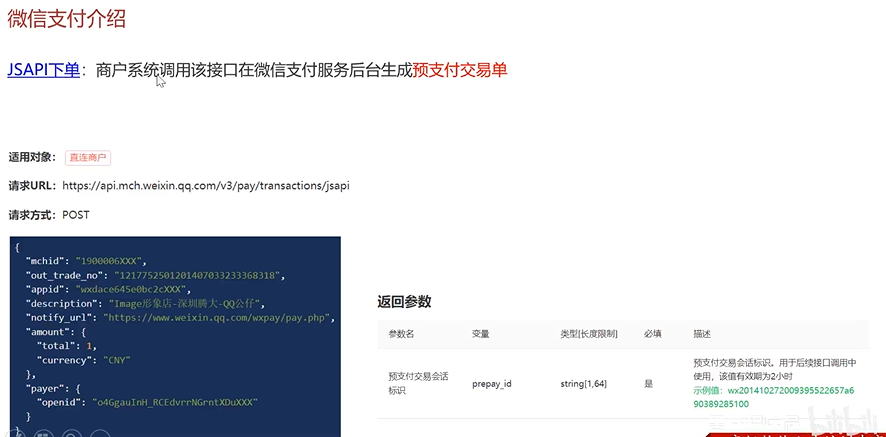
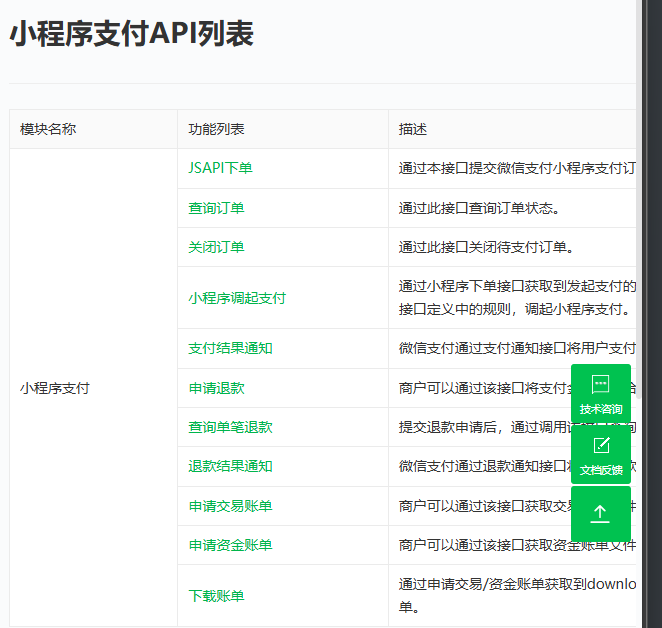
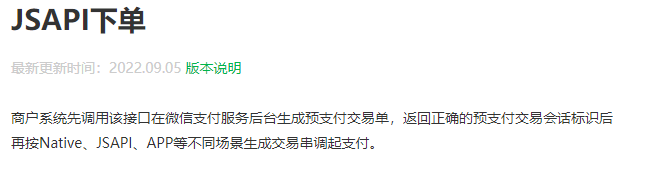
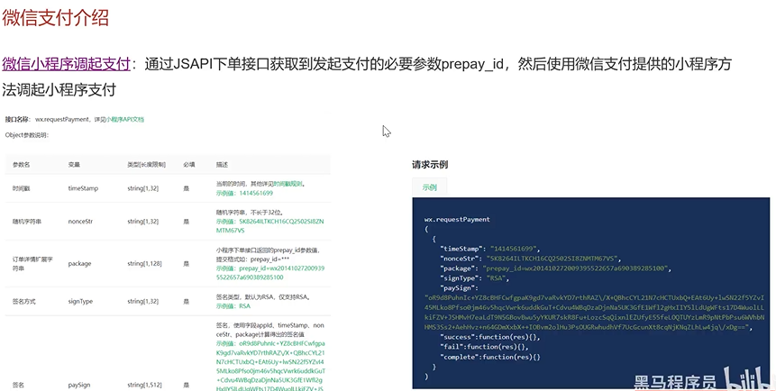
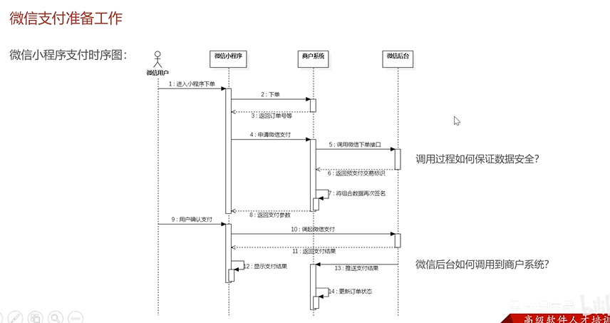
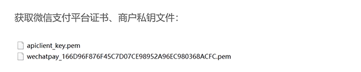
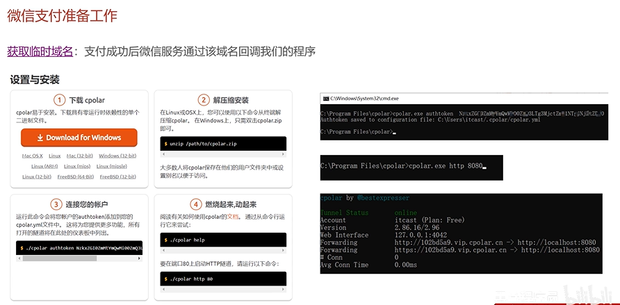

## 微信支付介绍

 

https://pay.weixin.qq.com/







[小程序支付API列表](https://pay.weixin.qq.com/wiki/doc/apiv3/open/pay/chapter2_8_3.shtml)



[JSAPI下单](https://pay.weixin.qq.com/wiki/doc/apiv3/apis/chapter3_5_1.shtml)





## 微信支付准备工作

1. 文件
2. 内网穿透（域名方案）
3. 





```
上面两个文件是从微信商户平台下载下来的
```



## 超时订单处理

