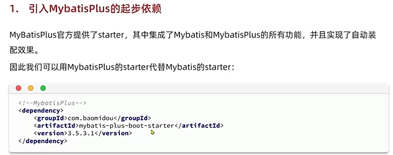
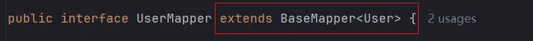
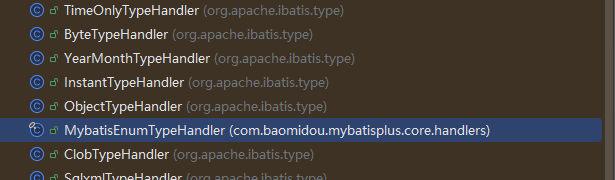
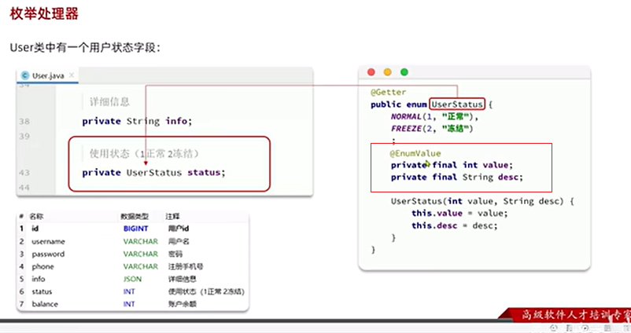
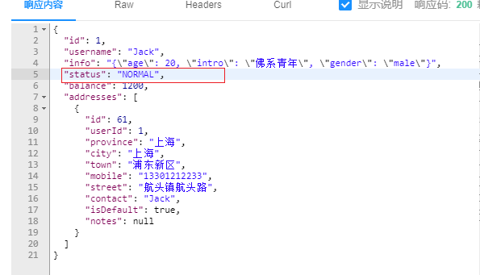
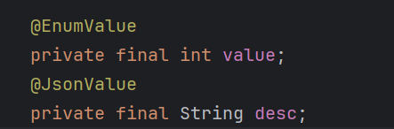
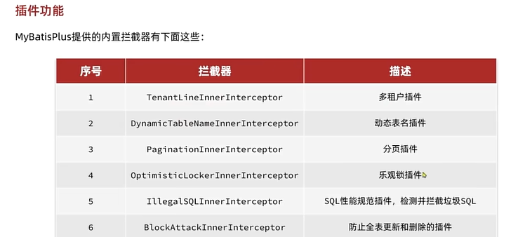
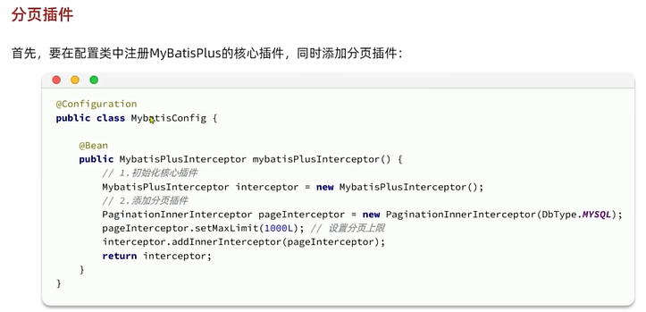
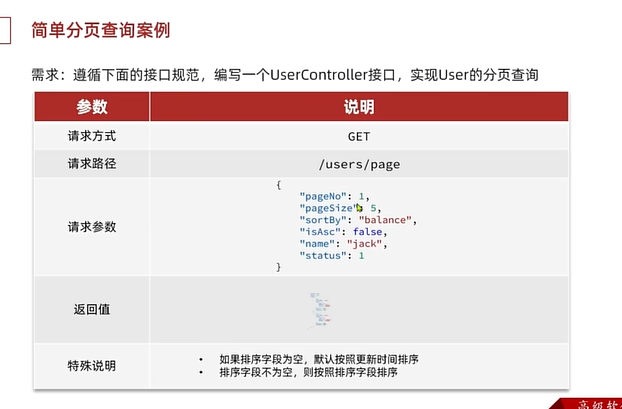
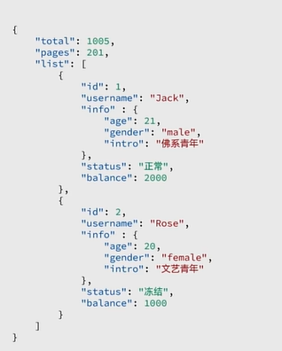

## 目录

 

## 快速入门

 

### 入门案例

#### (准备)导入数据库mp

 

#### (准备)导入项目mp-demo

 

#### 1. 引入MybatisPlus依赖

 

```xml
<!--mybatis-plus依赖（包含mybatis）-->
<dependency>
    <groupId>com.baomidou</groupId>
    <artifactId>mybatis-plus-spring-boot3-starter</artifactId>
    <version>3.5.7</version>
</dependency>
```

```
注意SpringBoot的版本
```


#### 2. 自定义的Mapper继承MybatisPlus提供的BaseMapper接口

 

> 增加	insert
> 删除        delete
> 修改	update
> 查询	select



### 常见注解

 

**约定（大于配置）**

1. 类名转下划线作为表名
2. 变量名驼峰转下划线作为表的字段名
3. 名为id的字段作为主键

> 不符合约定，如何操作？

 


 

修改表名

 

修改实体

 

### 常见配置

 

> 一般来说，只需要配置类型别名包

 

## 核心功能

### 条件构造器


### 自定义SQL

 


 


### Service接口

 

 

[在线笔记地址](https://b11et3un53m.feishu.cn/wiki/PsyawI04ei2FQykqfcPcmd7Dnsc)

 

### IService复杂查询

 

```java
    @Override
    public List<User> queryUsers(String name, Integer status, Integer minBalance, Integer maxBalance) {
        return lambdaQuery()
                .like(name != null, User::getUsername, name)
                .eq(status != null, User::getStatus, status)
                .ge(minBalance != null, User::getBalance, minBalance)
                .le(maxBalance != null, User::getBalance, maxBalance)
                .list();
    }
```

### IService复杂修改

```java
    @Override
    @Transactional
    public void deductBalance(Long id, Integer money) {
        // 查询金额是否足够
        User user = this.getById(id);
        if (user == null || user.getStatus() == 2) {
            throw new RuntimeException("用户状态异常!");
        }
        if (user.getBalance() < money) {
            throw new RuntimeException("用户余额不足");
        }
        int remainMoney = user.getBalance() - money;
        // 扣减金额
        lambdaUpdate()
                .set(User::getBalance, remainMoney)
                .set(remainMoney == 0, User::getStatus, 2)
                .eq(User::getId, id)
                .eq(User::getBalance, user.getBalance())
                .update();
    }
```

### IService批量插入

```java
private User buildUser(int i) {
    User user = new User();
    user.setUsername("user_" + i);
    user.setPassword("123");
    user.setPhone("18688990011");
    user.setBalance(200);
    user.setInfo("{\"age\": 24, \"intro\": \"英文老师\", \"gender\": \"female\"}");
    user.setCreateTime(LocalDateTime.now());
    user.setUpdateTime(LocalDateTime.now());
    return user;
}

@Test
void testSaveOneByOne() {
    long b = System.currentTimeMillis();
    for (int i = 0; i < 100000; i++) {
        userService.save(buildUser(i));
    }
    long e = System.currentTimeMillis();
    System.out.println("耗时：" + (e - b));
}

@Test
void testSaveBatch() {
    List<User> list = new ArrayList<>(1000);
    long b = System.currentTimeMillis();
    for (int i = 0; i < 100000; i++) {
        list.add(buildUser(i));
        if (i % 1000 == 0) {
            userService.saveBatch(list);
            list.clear();
        }
    }
    long e = System.currentTimeMillis();
    System.out.println("耗时：" + (e - b));
}
```

 

```
网络提交提高效率
SQL执行提高效率（MySQL）
```

配置文件添加后缀

```
&rewriteBatchedStatements=true
```

## 扩展功能

### 代码生成

> 二次元插件mybatisplus插件

### 静态工具

 

```java
    @Override
    public UserVO queryUserAndAdressById(Long id) {
        // 查询用户
        User user = this.getById(id);
        if (user == null || user.getStatus() == 2) {
            throw new RuntimeException("用户状态异常");
        }
        // 查询地址
        List<Address> addressList = Db.lambdaQuery(Address.class)
                .eq(Address::getUserId, id).list();
        UserVO userVO = BeanUtil.copyProperties(user, UserVO.class);
        if(CollUtil.isNotEmpty(addressList)){
            userVO.setAddresses(BeanUtil.copyToList(addressList, AddressVO.class));
        }
        return userVO;
    }
```

### 逻辑删除

 


```
可以采用数据迁移，然后真正删除.
```

### 枚举处理器

 

 

```java
import lombok.Getter;
@Getter
public enum UserStatus {
    NORMAL(1, "正常"),
    FREEZE(1, "正常");
    private final int value;
    private final String desc;
    UserStatus(int value, String desc) {
        this.value = value;
        this.desc = desc;
    }
}
```

```
数据类型是mybatis做的，不是mp做的。
```

 

 

#### 使用步骤

 


```java
import com.baomidou.mybatisplus.annotation.EnumValue;
import lombok.Getter;

@Getter
public enum UserStatus {
    NORMAL(1, "正常"),
    FROZEN(2, "正常");

    @EnumValue
    private final int value;
    private final String desc;


    UserStatus(int value, String desc) {
        this.value = value;
        this.desc = desc;
    }
}
```

```xml
mybatis-plus:
 configuration:
  default-enum-type-handler: com.baomidou.mybatisplus.core.handlers.MybatisEnumTypeHandler
```

 

> 根据图片，返回值是NORMAL,能不能是数字类型呢?
>
> 程序的数据往前端返回是SpringMVC处理的，而SpringMVC底层在处理JSON的时候是使用的Jackson，所以我们用Jackson提供的注解标记一下需要返回的属性就好

 

 

 

### JSON处理器

 

    

```java
@Data
@TableName(value = "tb_user",autoResultMap = true)
public class User {

    /**
     * 用户id
     */
    @TableId(type = IdType.AUTO)
    private Long id;

    /**
     * 用户名
     */
    @TableField("`username`")
    private String username;

    /**
     * 密码
     */
    private String password;

    /**
     * 注册手机号
     */
    private String phone;

    /**
     * 详细信息
     */
    @TableField(typeHandler = JacksonTypeHandler.class)
    private UserInfo info;
```

 

#### 步骤

1. 字段上加类型处理器
2. 表名上开启自动类型映射

## 插件



### 分页插件

 

   

#### 分页插件的配置

 

 

```java
import com.baomidou.mybatisplus.annotation.DbType;
import com.baomidou.mybatisplus.extension.plugins.MybatisPlusInterceptor;
import com.baomidou.mybatisplus.extension.plugins.inner.PaginationInnerInterceptor;
import org.springframework.context.annotation.Bean;
import org.springframework.context.annotation.Configuration;

@Configuration
public class MyBatisConfig {
    @Bean
    public MybatisPlusInterceptor mybatisPlusInterceptor(){
        MybatisPlusInterceptor interceptor = new MybatisPlusInterceptor();
        // 创建分页插件
        PaginationInnerInterceptor paginationInnerInterceptor = new PaginationInnerInterceptor(DbType.MYSQL);
        paginationInnerInterceptor.setMaxLimit(1000L);
        // 添加分页插件
        interceptor.addInnerInterceptor(paginationInnerInterceptor);
        return interceptor;
    }
}
```

```java
@Test
void testPage() {
    // 模拟参数传递
    int pageNo = 1, pageSize = 2;

    // 分页条件
    Page<User> page = Page.of(pageNo, pageSize);

    // 分页查询
    Page<User> p = userService.page(page);

    // 解析
    long total = p.getTotal();
    System.out.println(total);

    long pages = p.getPages();
    System.out.println(pages);

    List<User> records = p.getRecords();
    records.forEach(System.out::println);
}
```

> TODO
>
> 查看分页案例

 

 

> 带过滤条件的分页查询

> 关于复杂条件分页查询中实现方法的思考，我们可以使用page,然后需要传递两个参数，一个是page,另一个是wrapper,但是这样比较麻烦，所以可以使用lambdaQuery()，这个后面可以跟很多查询，然后最后跟上page,这样就解决了分页查询中条件和分页的问题。

> 关键是构建统一的查询条件和返回值
