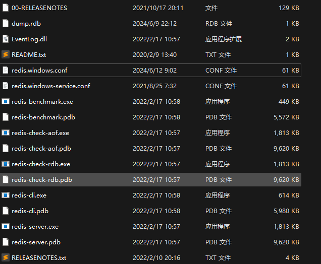
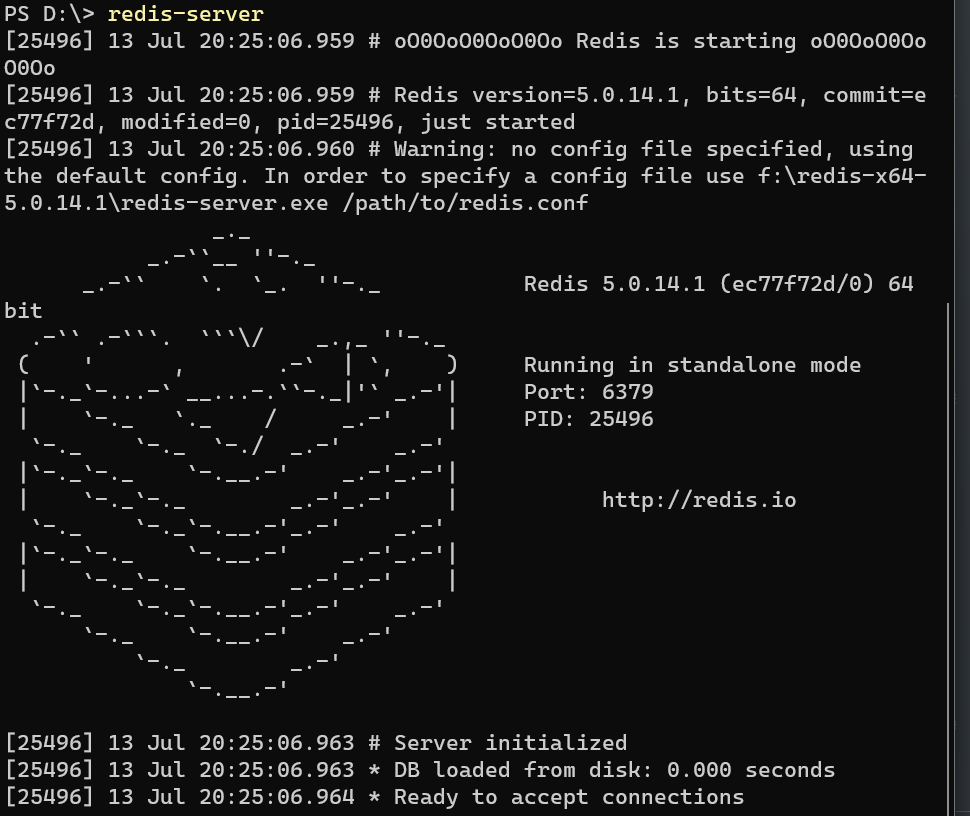
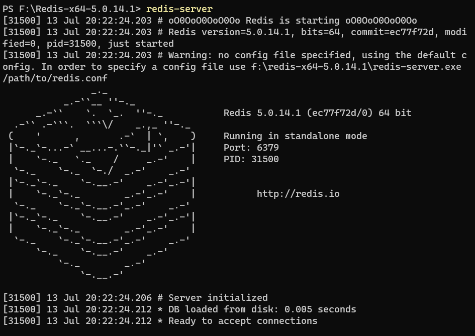
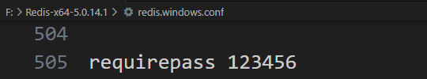
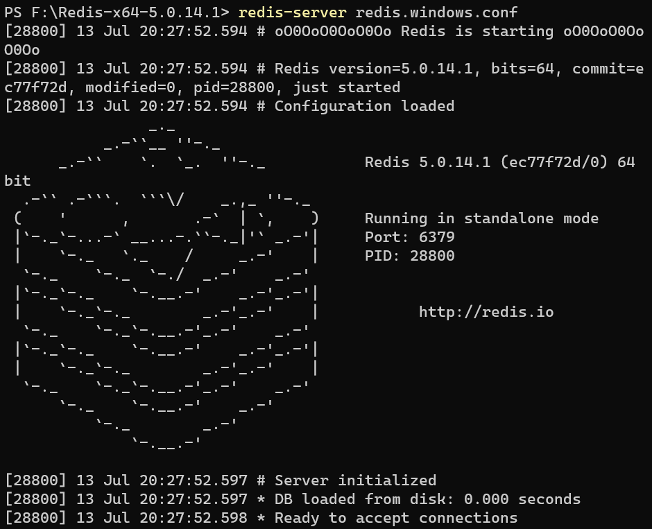
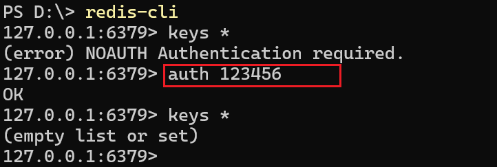
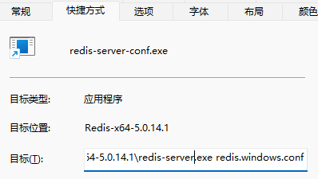
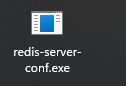

## 安装Redis

 

## 配置环境变量，并且检测效果

## 启动Redis, 不使用Redis

 

## 修改配置文件，并且以配置文件方式启动Redis

### 修改配置文件redis.windows.conf

 

### 找到对应目录，以配置文件方式启动Redis

### 登录redis-cli,检验密码有效性

 

### 设置配置文件启动服务器的快捷方式

#### 新建一个快捷方式

 

#### 修改目标

 

#### 固定到开始

 

