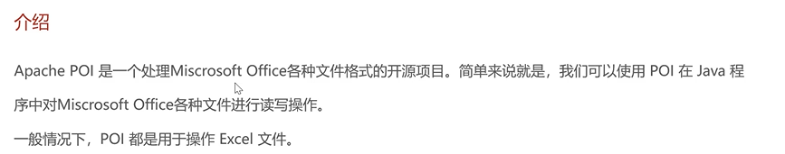
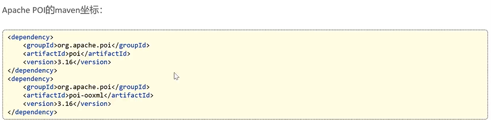

## 

## 使用步骤

### 导入Maven坐标



```xml
<!-- poi -->
<dependency>
    <groupId>org.apache.poi</groupId>
    <artifactId>poi</artifactId>
</dependency>
<dependency>
    <groupId>org.apache.poi</groupId>
    <artifactId>poi-ooxml</artifactId>
</dependency>
```

### 写入示例

```java
package com.sky.test;

import org.apache.poi.xssf.usermodel.XSSFRow;
import org.apache.poi.xssf.usermodel.XSSFSheet;
import org.apache.poi.xssf.usermodel.XSSFWorkbook;

import java.io.File;
import java.io.FileOutputStream;
import java.io.IOException;

/**
 * 使用POI使用EXCEL文件
 */
public class POITest {
    /**
     * 通过POI创建EXCEL文件，并且写入内容
     */
    public static void write() throws IOException {
        // 在内存中创建一个EXCEL文件
        XSSFWorkbook excel = new XSSFWorkbook();
        // 在EXCEL文件中创建一个Sheet页
        XSSFSheet infoSheet = excel.createSheet("info");

        // 在Sheet中创建行对象，行号从0开始
        XSSFRow row = infoSheet.createRow(1);
        row.createCell(1).setCellValue("姓名");
        row.createCell(2).setCellValue("城市");

        // 创建新行
        row = infoSheet.createRow(2);
        row.createCell(1).setCellValue("张三");
        row.createCell(2).setCellValue("北京");

        // 创建新行
        row = infoSheet.createRow(3);
        row.createCell(1).setCellValue("李四");
        row.createCell(2).setCellValue("南京");

        // 输出流：内存 -> 磁盘
        FileOutputStream fileOutputStream = new FileOutputStream(new File("D:/info.xlsx"));
        excel.write(fileOutputStream);

        // 关闭资源
        fileOutputStream.close();
        excel.close();
    }


    public static void main(String[] args) throws IOException {
        write();
    }
}
```

### 读取操作

```java
package com.sky.test;

import org.apache.poi.xssf.usermodel.XSSFRow;
import org.apache.poi.xssf.usermodel.XSSFSheet;
import org.apache.poi.xssf.usermodel.XSSFWorkbook;

import java.io.*;

/**
 * 使用POI使用EXCEL文件
 */
public class POITest {
    /**
     * 通过POI读取EXCEL文件
     */
    public static void read() throws IOException {
        FileInputStream fileInputStream = new FileInputStream(new File("D:/info.xlsx"));
        // 读取磁盘上已经存在的EXCEL文件
        XSSFWorkbook excel = new XSSFWorkbook(fileInputStream);
        // 读取Sheet
        XSSFSheet sheet = excel.getSheetAt(0);
        // 获取最后一行的行号
        int lastRowNum = sheet.getLastRowNum();
        for (int i = 1; i <= lastRowNum; i++) {
            XSSFRow row = sheet.getRow(i);
            String cellValue1 = row.getCell(1).getStringCellValue();
            String cellValue2 = row.getCell(2).getStringCellValue();
            System.out.println(cellValue1 + " " + cellValue2);
        }
        // 关闭资源
        fileInputStream.close();
        excel.close();
    }
    public static void main(String[] args) throws IOException {
        read();
    }
}
```

## 导出报表

