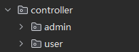

## 使用步骤

### 依赖

```xml
<!--Knife4j-->
<dependency>
    <groupId>com.github.xiaoymin</groupId>
    <artifactId>knife4j-spring-boot-starter</artifactId>
    <version>3.0.2</version>
</dependency>
```

### 配置

```java
package com.example.config;

import org.springframework.context.annotation.Bean;
import org.springframework.context.annotation.Configuration;
import org.springframework.web.servlet.config.annotation.ResourceHandlerRegistry;
import org.springframework.web.servlet.config.annotation.WebMvcConfigurationSupport;
import springfox.documentation.builders.ApiInfoBuilder;
import springfox.documentation.builders.PathSelectors;
import springfox.documentation.builders.RequestHandlerSelectors;
import springfox.documentation.service.ApiInfo;
import springfox.documentation.spi.DocumentationType;
import springfox.documentation.spring.web.plugins.Docket;

@Configuration
public class WebMvcConfig extends WebMvcConfigurationSupport {
    @Bean
    public Docket adminDocket() {
        ApiInfo apiInfo = new ApiInfoBuilder()
                .title("项目接口文档")
                .description("项目接口文档")
                .version("2.0")
                .build();
        return new Docket(DocumentationType.SWAGGER_2)
                .groupName("管理端")
                .apiInfo(apiInfo)
                .select()
                .apis(RequestHandlerSelectors.basePackage("com.example.controller.admin"))
                .paths(PathSelectors.any())
                .build();
    }

    @Bean
    public Docket userDocket() {
        ApiInfo apiInfo = new ApiInfoBuilder()
                .title("项目接口文档")
                .description("项目接口文档")
                .version("2.0")
                .build();
        return new Docket(DocumentationType.SWAGGER_2)
                .groupName("用户端")
                .apiInfo(apiInfo)
                .select()
                .apis(RequestHandlerSelectors.basePackage("com.example.controller.user"))
                .paths(PathSelectors.any())
                .build();
    }

    @Override
    protected void addResourceHandlers(ResourceHandlerRegistry registry) {
               registry.addResourceHandler("/doc.html").addResourceLocations("classpath:/META-INF/resources/");
        registry.addResourceHandler("/webjars/**").addResourceLocations("classpath:/META-INF/resources/webjars/");
    }
}
```

### 使用

 

```java
package com.example.controller.admin;

import io.swagger.annotations.Api;
import io.swagger.annotations.ApiOperation;
import org.springframework.web.bind.annotation.GetMapping;
import org.springframework.web.bind.annotation.RequestMapping;
import org.springframework.web.bind.annotation.RestController;

@RestController
@RequestMapping("/admin")
@Api(tags = "管理接口")
public class AdminController {
    @GetMapping("/hello")
    @ApiOperation(value = "你好")
    public String hello() {
        return "hello";
    }
}
```

```java
package com.example.controller.user;

import io.swagger.annotations.Api;
import io.swagger.annotations.ApiOperation;
import org.springframework.web.bind.annotation.GetMapping;
import org.springframework.web.bind.annotation.RequestMapping;
import org.springframework.web.bind.annotation.RestController;

@RestController
@RequestMapping("/user")
@Api(tags = "用户接口")
public class HelloController {
    @GetMapping("/hello")
    @ApiOperation(value = "你好")
    public String hello() {
        return "hello";
    }
}
```

```java
@Data
@Builder
@NoArgsConstructor
@AllArgsConstructor
@ApiModel(description = "员工登录返回的数据格式")
public class EmployeeLoginVO implements Serializable {

    @ApiModelProperty("主键值")
    private Long id;

    @ApiModelProperty("用户名")
    private String userName;

    @ApiModelProperty("姓名")
    private String name;

    @ApiModelProperty("jwt令牌")
    private String token;

}
```