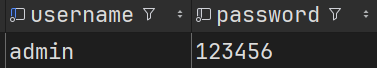
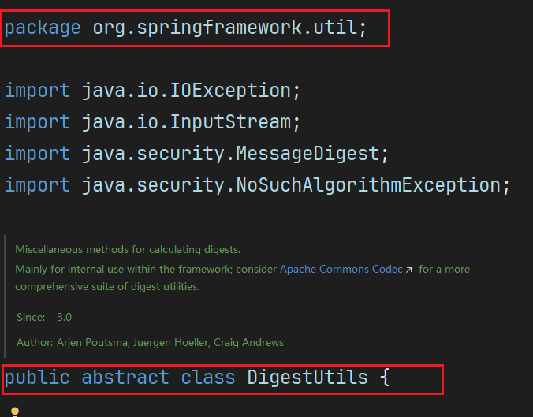
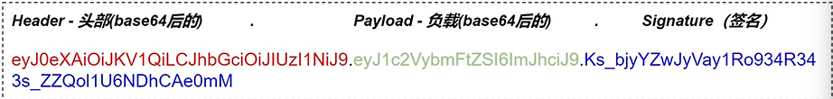
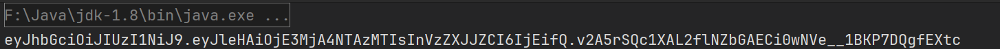
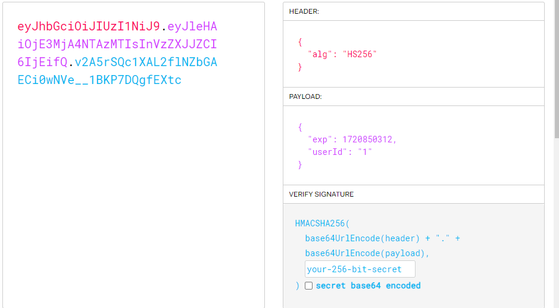
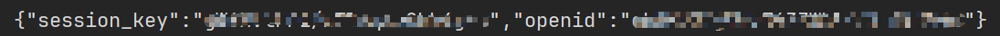
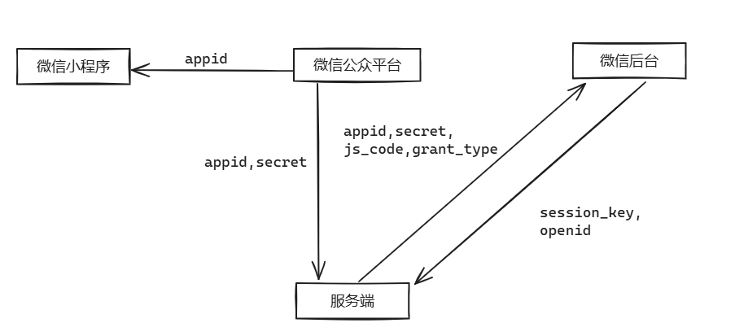

## 后台-管理员-登录和鉴权

```java
@PostMapping("/login")
@ApiOperation(value = "员工登录")
public Result<EmployeeLoginVO> login(@RequestBody EmployeeLoginDTO employeeLoginDTO) {
    log.info("员工登录：{}", employeeLoginDTO);

    Employee employee = employeeService.login(employeeLoginDTO);

    //登录成功后，生成jwt令牌
    Map<String, Object> claims = new HashMap<>();
    claims.put(JwtClaimsConstant.EMP_ID, employee.getId());

    // 动态加载
    String token = JwtUtil.createJWT(
            jwtProperties.getAdminSecretKey(),
            jwtProperties.getAdminTtl(),
            claims);

    EmployeeLoginVO employeeLoginVO = EmployeeLoginVO.builder()
            .id(employee.getId())
            .userName(employee.getUsername())
            .name(employee.getName())
            .token(token)
            .build();
    return Result.success(employeeLoginVO);
}
```

### 密码加密研究

 

密码一开始是明文存储，我们需要改为密文存储，并且对加密的方法进行研究

#### 研究加密方法

```java
password = DigestUtils.md5DigestAsHex(password.getBytes());
```

 

#### 在测试中使用加密方法，获取123456的密文

```java
@Test
void login() {
    String s = DigestUtils.md5DigestAsHex("123456".getBytes());
    System.out.println(s);
    // e10adc3949ba59abbe56e057f20f883e
}
```

#### 在数据库更新密码

 

### JWT登录研究

#### JWT是什么

 

 

 https://jwt.io/

#### 使用方法

1. 引入依赖
2. 导入JWT的创建和解析方法
3. 使用

```xml
<!--jjwt-->
<dependency>
    <groupId>io.jsonwebtoken</groupId>
    <artifactId>jjwt</artifactId>
    <version>0.9.1</version>
</dependency>
```

```java
import io.jsonwebtoken.Claims;
import io.jsonwebtoken.JwtBuilder;
import io.jsonwebtoken.Jwts;
import io.jsonwebtoken.SignatureAlgorithm;

import java.nio.charset.StandardCharsets;
import java.util.Date;
import java.util.HashMap;
import java.util.Map;

public class JJwtDemo {
    public static void main(String[] args) {
        Map<String, Object> map = new HashMap<>();
        map.put("userId", "1");
        String wzd = createJWT(
                "hha", 1000 * 60, map
        );
        System.out.println(wzd);
    }

  /**
     * 生成jwt
     * 使用Hs256算法, 私匙使用固定秘钥
     *
     * @param secretKey jwt秘钥
     * @param ttlMillis jwt过期时间(毫秒)
     * @param claims    设置的信息
     * @return
     */
    public static String createJWT(String secretKey, long ttlMillis, Map<String, Object> claims) {
        // 指定签名的时候使用的签名算法，也就是header那部分
        SignatureAlgorithm signatureAlgorithm = SignatureAlgorithm.HS256;

        // 生成JWT的时间
        long expMillis = System.currentTimeMillis() + ttlMillis;
        Date exp = new Date(expMillis);

        // 设置jwt的body
        JwtBuilder builder = Jwts.builder()
                // 如果有私有声明，一定要先设置这个自己创建的私有的声明，这个是给builder的claim赋值，一旦写在标准的声明赋值之后，就是覆盖了那些标准的声明的
                .setClaims(claims)
                // 设置签名使用的签名算法和签名使用的秘钥
                .signWith(signatureAlgorithm, secretKey.getBytes(StandardCharsets.UTF_8))
                // 设置过期时间
                .setExpiration(exp);

        return builder.compact();
    }

    /**
     * Token解密
     *
     * @param secretKey jwt秘钥 此秘钥一定要保留好在服务端, 不能暴露出去, 否则sign就可以被伪造, 如果对接多个客户端建议改造成多个
     * @param token     加密后的token
     * @return
     */
    public static Claims parseJWT(String secretKey, String token) {
        // 得到DefaultJwtParser
        Claims claims = Jwts.parser()
                // 设置签名的秘钥
                .setSigningKey(secretKey.getBytes(StandardCharsets.UTF_8))
                // 设置需要解析的jwt
                .parseClaimsJws(token).getBody();
        return claims;
    }
}
```

#### 结果





### 鉴权（拦截器方案）

[Spring Boot 中使用拦截器](https://blog.csdn.net/taojin12/article/details/88342576)

#### 定义拦截器，继承自HandlerInterceptor, 重写preHandle方法

```java
import com.qindao.constant.JwtClaimsConstant;
import com.qindao.context.BaseContext;
import com.qindao.properties.JwtProperties;
import com.qindao.utils.JwtUtil;
import io.jsonwebtoken.Claims;
import lombok.extern.slf4j.Slf4j;
import org.springframework.beans.factory.annotation.Autowired;
import org.springframework.stereotype.Component;
import org.springframework.web.method.HandlerMethod;
import org.springframework.web.servlet.HandlerInterceptor;

import javax.servlet.http.HttpServletRequest;
import javax.servlet.http.HttpServletResponse;

/**
 * jwt令牌校验的拦截器
 */
@Component
@Slf4j
public class JwtTokenAdminInterceptor implements HandlerInterceptor {

    @Autowired
    private JwtProperties jwtProperties;

    /**
     * 校验jwt
     *
     * @param request
     * @param response
     * @param handler
     * @return
     * @throws Exception
     */
    public boolean preHandle(HttpServletRequest request, HttpServletResponse response, Object handler) throws Exception {
        //System.out.println("当前线程的id:"+Thread.currentThread().getId());

        //判断当前拦截到的是Controller的方法还是其他资源
        if (!(handler instanceof HandlerMethod)) {
            //当前拦截到的不是动态方法，直接放行
            return true;
        }

        //1、从请求头中获取令牌
        String token = request.getHeader(jwtProperties.getAdminTokenName());

        //2、校验令牌
        try {
            log.info("jwt校验:{}", token);
            Claims claims = JwtUtil.parseJWT(jwtProperties.getAdminSecretKey(), token);
            Long empId = Long.valueOf(claims.get(JwtClaimsConstant.EMP_ID).toString());
            log.info("当前员工id：{}", empId);
            BaseContext.setCurrentId(empId);
            //3、通过，放行
            return true;
        } catch (Exception ex) {
            //4、不通过，响应401状态码
            response.setStatus(401);
            return false;
        }
    }
}
```

#### 方法中使用ThreadLocal

 

```java
public class BaseContext {
    public static ThreadLocal<Long> threadLocal = new ThreadLocal<>();

    public static void setCurrentId(Long id) {
        threadLocal.set(id);
    }

    public static Long getCurrentId() {
        return threadLocal.get();
    }

    public static void removeCurrentId() {
        threadLocal.remove();
    }
}
```

#### 配置拦截器

```java
import com.qindao.interceptor.JwtTokenAdminInterceptor;
import com.qindao.interceptor.JwtTokenUserInterceptor;
import com.qindao.json.JacksonObjectMapper;
import lombok.extern.slf4j.Slf4j;
import org.springframework.beans.factory.annotation.Autowired;
import org.springframework.context.annotation.Bean;
import org.springframework.context.annotation.Configuration;
import org.springframework.http.converter.HttpMessageConverter;
import org.springframework.http.converter.json.MappingJackson2HttpMessageConverter;
import org.springframework.web.servlet.config.annotation.InterceptorRegistry;
import org.springframework.web.servlet.config.annotation.ResourceHandlerRegistry;
import org.springframework.web.servlet.config.annotation.WebMvcConfigurationSupport;
import springfox.documentation.builders.ApiInfoBuilder;
import springfox.documentation.builders.PathSelectors;
import springfox.documentation.builders.RequestHandlerSelectors;
import springfox.documentation.service.ApiInfo;
import springfox.documentation.spi.DocumentationType;
import springfox.documentation.spring.web.plugins.Docket;

import java.util.List;

/**
 * 配置类，注册web层相关组件
 */
@Configuration
@Slf4j
public class WebMvcConfiguration extends WebMvcConfigurationSupport {
    @Autowired
    private JwtTokenUserInterceptor jwtTokenUserInterceptor;
    /**
     * 注册自定义拦截器
     *
     * @param registry
     */
    protected void addInterceptors(InterceptorRegistry registry) {
        log.info("开始注册自定义拦截器...");
        registry.addInterceptor(jwtTokenAdminInterceptor)
                .addPathPatterns("/admin/**")
                .excludePathPatterns("/admin/employee/login");
    }
}
```

[SpringBoot之静态资源](https://lanyu.blog.csdn.net/article/details/139323175?spm=1001.2101.3001.6650.5&utm_medium=distribute.pc_relevant.none-task-blog-2~default~YuanLiJiHua~Position-5-139323175-blog-120928070.235^v43^pc_blog_bottom_relevance_base7&depth_1-utm_source=distribute.pc_relevant.none-task-blog-2~default~YuanLiJiHua~Position-5-139323175-blog-120928070.235^v43^pc_blog_bottom_relevance_base7&utm_relevant_index=8)

## 前台-用户-微信登录（微信小程序）

### 请求发送工具代码

#### 依赖

```xml
<!--微信支付-->
<dependency>
    <groupId>com.github.wechatpay-apiv3</groupId>
    <artifactId>wechatpay-apache-httpclient</artifactId>
    <version>0.4.8</version>
</dependency>

<dependency>
    <groupId>com.alibaba</groupId>
    <artifactId>fastjson</artifactId>
    <version>1.2.76</version>
</dependency
```

#### 代码

```java
import com.alibaba.fastjson.JSONObject;
import org.apache.http.NameValuePair;
import org.apache.http.client.config.RequestConfig;
import org.apache.http.client.entity.UrlEncodedFormEntity;
import org.apache.http.client.methods.CloseableHttpResponse;
import org.apache.http.client.methods.HttpGet;
import org.apache.http.client.methods.HttpPost;
import org.apache.http.client.utils.URIBuilder;
import org.apache.http.entity.StringEntity;
import org.apache.http.impl.client.CloseableHttpClient;
import org.apache.http.impl.client.HttpClients;
import org.apache.http.message.BasicNameValuePair;
import org.apache.http.util.EntityUtils;

import java.io.IOException;
import java.net.URI;
import java.util.ArrayList;
import java.util.HashMap;
import java.util.List;
import java.util.Map;

/**
 * Http工具类
 */
public class HttpClientUtil {

    static final int TIMEOUT_MSEC = 5 * 1000;

    /**
     * 发送GET方式请求
     *
     * @param url
     * @param paramMap
     * @return
     */
    public static String doGet(String url, Map<String, String> paramMap) {
        // 创建Httpclient对象
        CloseableHttpClient httpClient = HttpClients.createDefault();

        String result = "";
        CloseableHttpResponse response = null;

        try {
            URIBuilder builder = new URIBuilder(url);
            if (paramMap != null) {
                for (String key : paramMap.keySet()) {
                    builder.addParameter(key, paramMap.get(key));
                }
            }
            URI uri = builder.build();

            //创建GET请求
            HttpGet httpGet = new HttpGet(uri);

            //发送请求
            response = httpClient.execute(httpGet);

            //判断响应状态
            if (response.getStatusLine().getStatusCode() == 200) {
                result = EntityUtils.toString(response.getEntity(), "UTF-8");
            }
        } catch (Exception e) {
            e.printStackTrace();
        } finally {
            try {
                response.close();
                httpClient.close();
            } catch (IOException e) {
                e.printStackTrace();
            }
        }

        return result;
    }

    /**
     * 发送POST方式请求
     *
     * @param url
     * @param paramMap
     * @return
     * @throws IOException
     */
    public static String doPost(String url, Map<String, String> paramMap) throws IOException {
        // 创建Httpclient对象
        CloseableHttpClient httpClient = HttpClients.createDefault();
        CloseableHttpResponse response = null;
        String resultString = "";

        try {
            // 创建Http Post请求
            HttpPost httpPost = new HttpPost(url);

            // 创建参数列表
            if (paramMap != null) {
                List<NameValuePair> paramList = new ArrayList();
                for (Map.Entry<String, String> param : paramMap.entrySet()) {
                    paramList.add(new BasicNameValuePair(param.getKey(), param.getValue()));
                }
                // 模拟表单
                UrlEncodedFormEntity entity = new UrlEncodedFormEntity(paramList);
                httpPost.setEntity(entity);
            }

            httpPost.setConfig(builderRequestConfig());

            // 执行http请求
            response = httpClient.execute(httpPost);

            resultString = EntityUtils.toString(response.getEntity(), "UTF-8");
        } catch (Exception e) {
            throw e;
        } finally {
            try {
                response.close();
            } catch (IOException e) {
                e.printStackTrace();
            }
        }

        return resultString;
    }

    /**
     * 发送POST方式请求
     *
     * @param url
     * @param paramMap
     * @return
     * @throws IOException
     */
    public static String doPost4Json(String url, Map<String, String> paramMap) throws IOException {
        // 创建Httpclient对象
        CloseableHttpClient httpClient = HttpClients.createDefault();
        CloseableHttpResponse response = null;
        String resultString = "";

        try {
            // 创建Http Post请求
            HttpPost httpPost = new HttpPost(url);

            if (paramMap != null) {
                //构造json格式数据
                JSONObject jsonObject = new JSONObject();
                for (Map.Entry<String, String> param : paramMap.entrySet()) {
                    jsonObject.put(param.getKey(), param.getValue());
                }
                StringEntity entity = new StringEntity(jsonObject.toString(), "utf-8");
                //设置请求编码
                entity.setContentEncoding("utf-8");
                //设置数据类型
                entity.setContentType("application/json");
                httpPost.setEntity(entity);
            }

            httpPost.setConfig(builderRequestConfig());

            // 执行http请求
            response = httpClient.execute(httpPost);

            resultString = EntityUtils.toString(response.getEntity(), "UTF-8");
        } catch (Exception e) {
            throw e;
        } finally {
            try {
                response.close();
            } catch (IOException e) {
                e.printStackTrace();
            }
        }

        return resultString;
    }

    private static RequestConfig builderRequestConfig() {
        return RequestConfig.custom()
                .setConnectTimeout(TIMEOUT_MSEC)
                .setConnectionRequestTimeout(TIMEOUT_MSEC)
                .setSocketTimeout(TIMEOUT_MSEC).build();
    }
}
```

### 控制层代码

```java
/**
 * 微信登录
 *
 * @param userLoginDTO
 * @return4
 */
@RequestMapping("/login")
@ApiOperation("微信登录")
public Result<UserLoginVO> login(@RequestBody UserLoginDTO userLoginDTO) {
    log.info("微信用户登录:{}", userLoginDTO);
    // 微信登录
    User user = userService.wxLogin(userLoginDTO);

    // 为微信用户生成JWT令牌
    Map<String, Object> claims = new HashMap<>();
    claims.put(JwtClaimsConstant.USER_ID, user.getId());
    String token = JwtUtil.createJWT(jwtProperties.getUserSecretKey(), jwtProperties.getUserTtl(), claims);
    UserLoginVO userLoginVO = UserLoginVO.builder()
            .id(user.getId())
            .openid(user.getOpenid())
            .token(token)
            .build();
    System.out.println("登录成功");
    return Result.success(userLoginVO);
}
```

### 业务逻辑代码

```java
/**
 * 微信登录
 *
 * @param userLoginDTO
 * @return
 */
@Override
public User wxLogin(UserLoginDTO userLoginDTO) {
    // 获取openid
    String openid = getOpenid(userLoginDTO.getCode());

    // 判断openid是否为空，如果为空表示失败，抛出业务异常
    if (openid == null) {
        throw new LoginFailedException(MessageConstant.LOGIN_FAILED);
    }

    // 判断当前用户是否为新用户
    User user = userMapper.getByOpenid(openid);

    // 如果是新用户，自动完成注册
    if (user == null) {
        user = User.builder()
                .openid(openid)
                .createTime(LocalDateTime.now())
                .build();
        userMapper.insert(user);
    }

    // 返回这个用户对象
    return user;
}

/**
 * 根据微信小程序提供的code调用微信接口，获取当前用户的openid。
 *
 * @param code 由微信小程序授权时获取的code，用于换取openid。
 * @return 返回从微信接口获取到的用户openid。
 */
private String getOpenid(String code) {
    // 准备调用微信接口所需的参数
    Map<String, String> map = new HashMap<>();
    map.put("appid", weChatProperties.getAppid());
    map.put("secret", weChatProperties.getSecret());
    map.put("js_code", code);
    map.put("grant_type", "authorization_code");

    // 向微信接口发送请求，获取响应
    String json = HttpClientUtil.doGet(WX_LOGIN, map);

    // 解析响应，提取openid
    JSONObject jsonObject = JSON.parseObject(json);
    String openid = jsonObject.getString("openid");
    return openid;
}
```

#### json的返回形式

 

### 流程



### 微信帮助文档

[开放能力 / 用户信息 / 小程序登录 (qq.com)](https://developers.weixin.qq.com/miniprogram/dev/framework/open-ability/login.html)

[小程序登录 / 小程序登录 (qq.com)](https://developers.weixin.qq.com/miniprogram/dev/OpenApiDoc/user-login/code2Session.html)


